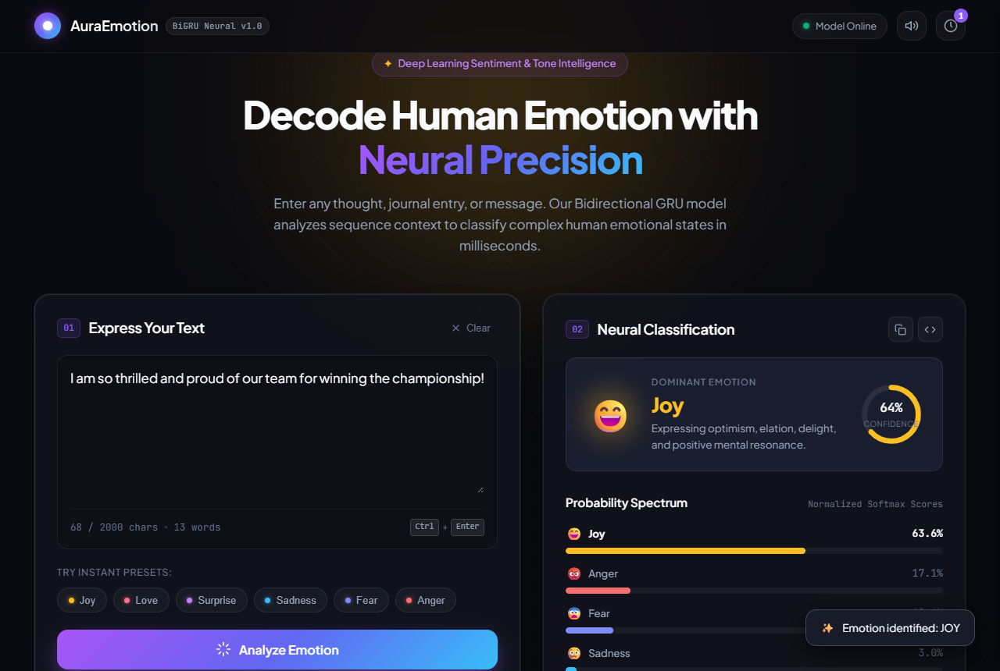
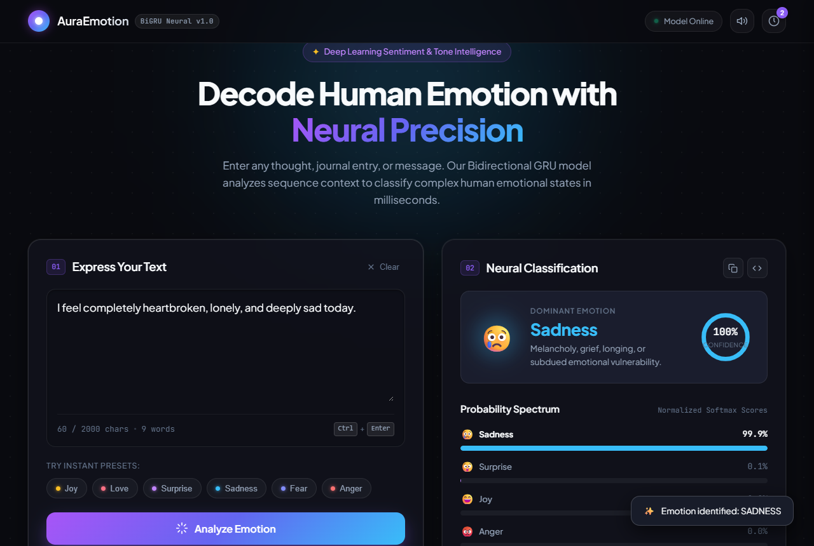
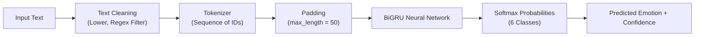

# 🎭 Emotion Prediction Web Application & REST API

[](https://fastapi.tiangolo.com)
[](https://tensorflow.org)
[](https://www.python.org/)
[](https://render.com/)

An end-to-end Natural Language Processing (NLP) deep learning application that analyzes sentences and predicts human emotions in real time. Powered by a **Bidirectional Gated Recurrent Unit (BiGRU)** neural network, an asynchronous **FastAPI** backend, and an interactive glassmorphic web interface.

---

## 📸 Output & UI Preview

Here are sample outputs of the application analyzing different emotional texts:

### 1. Emotion: Joy 😄
> *"I am so thrilled and proud of our team for winning the championship!"*



---

### 2. Emotion: Sadness 😢
> *"I feel completely heartbroken, lonely, and deeply sad today."*



---

## 🌟 Emotion Taxonomy

The neural network classifies input sentences into six core emotional categories:

| Emotion | Emoji | Color Aura | Description |
| :--- | :---: | :---: | :--- |
| **Joy** | 😄 | Amber / Gold | Optimism, happiness, elation, delight |
| **Love** | ❤️ | Rose / Pink | Affection, warmth, gratitude, heartfelt connection |
| **Surprise** | 😲 | Purple | Astonishment, unexpected wonder, curiosity |
| **Sadness** | 😢 | Sky Blue | Melancholy, grief, vulnerability, longing |
| **Fear** | 😨 | Indigo | Apprehension, worry, anxiety, suspense |
| **Anger** | 😡 | Crimson | Frustration, irritation, resentment |

---

## 🚀 Key Features

- **Deep Learning BiGRU Model**: Sequence classification neural network with custom word embedding and post-padded sequences.
- **FastAPI Backend**: Fast, asynchronous REST API with Pydantic v2 schemas and validation.
- **Modern Interactive UI**: Responsive glassmorphism interface featuring dynamic mood ambient glows, real-time confidence gauges, audio feedback, preset prompt chips, and history storage.
- **Render Cloud Ready**: Pre-configured with `render.yaml` and `.python-version` (Python 3.11) for seamless 1-click cloud deployment on Render.
- **Interactive Documentation**: Auto-generated interactive Swagger UI (`/docs`) and ReDoc (`/redoc`).

---

## 📁 Project Structure

```text
Emotion-Prediction-Project/
├── Artifacts/
│   ├── BiGRU_model.keras       # Trained Bidirectional GRU Keras model (~41.5 MB)
│   └── tokenizer.pkl           # Keras text tokenizer (~607 KB)
├── assets/
│   ├── emotion_output_joy.png      # Output preview 1 (Joy)
│   └── emotion_output_sadness.png  # Output preview 2 (Sadness)
├── static/
│   ├── app.js                  # Frontend logic & API interaction
│   ├── index.html              # Web interface
│   └── style.css               # Glassmorphism design system & styles
├── .gitignore                  # Git exclusions (caches, virtualenvs, Project_activ.txt)
├── .python-version             # Python 3.11.8 pin for cloud deployment
├── main.py                     # FastAPI server & inference endpoints
├── render.yaml                 # Render Blueprint deployment configuration
├── requirements.txt            # Python dependencies
└── README.md                   # Project documentation
```

---

## 🛠️ Local Setup & Execution

### Prerequisites
- **Python 3.11** installed
- Git

### 1. Clone or Open the Repository
```bash
cd "Emotion Prediction Project"
```

### 2. Create and Activate Virtual Environment

**Windows (PowerShell):**
```powershell
py -3.11 -m venv emotionpredictionenv
.\emotionpredictionenv\Scripts\activate
```

**Linux / macOS:**
```bash
python3.11 -m venv emotionpredictionenv
source emotionpredictionenv/bin/activate
```

### 3. Install Dependencies
```bash
pip install -r requirements.txt
```

### 4. Run the Development Server
```bash
uvicorn main:app --reload
```
Or run directly:
```bash
python main.py
```

Open your browser and visit:
- **Interactive UI**: [http://127.0.0.1:8000](http://127.0.0.1:8000)
- **API Documentation**: [http://127.0.0.1:8000/docs](http://127.0.0.1:8000/docs)
- **Health Check**: [http://127.0.0.1:8000/health](http://127.0.0.1:8000/health)

---

## 📡 API Endpoints

### 1. Predict Emotion
```http
POST /predict
Content-Type: application/json
```

**Request Body:**
```json
{
  "text": "I was totally speechless when they announced our team won first place!"
}
```

**Response (200 OK):**
```json
{
  "text": "I was totally speechless when they announced our team won first place!",
  "predicted_emotion": "surprise",
  "confidence": 0.8924,
  "all_probabilities": {
    "sadness": 0.0081,
    "joy": 0.0712,
    "love": 0.0125,
    "anger": 0.0043,
    "fear": 0.0115,
    "surprise": 0.8924
  }
}
```

---

### 2. Health Check
```http
GET /health
```
**Response:**
```json
{
  "status": "Server is healthy and running",
  "model_loaded": true
}
```

---

## ☁️ Deploying to Render

The project includes `render.yaml` and `.python-version` configured for direct deployment as a Python Web Service on Render.

### Quick Deployment Steps:

1. Log in to [Render Dashboard](https://dashboard.render.com/) with your GitHub account.
2. Click **"New +"** and select **"Web Service"**.
3. Choose **"Build and deploy from a Git repository"** and select **`Emotion_Prediction_`**.
4. Configure the service settings (if not automatically populated by `render.yaml`):
   - **Name**: `emotion-prediction-app` (or your preferred name)
   - **Language**: `Python 3`
   - **Branch**: `main`
   - **Region**: Nearest to you (e.g. `Oregon (US West)` or `Singapore`)
   - **Build Command**: `pip install --upgrade pip && pip install -r requirements.txt`
   - **Start Command**: `uvicorn main:app --host 0.0.0.0 --port $PORT`
   - **Instance Type**: `Free`
5. Under **Advanced** &rarr; **Environment Variables**, add:
   - `PYTHON_VERSION` = `3.11.8`
6. Click **"Create Web Service"**.

> **💡 Render Tip**: Render automatically handles the `$PORT` environment variable and supports long-running FastAPI instances with memory allocations suited for TensorFlow models. When using the Free tier, services spin down after 15 minutes of inactivity and wake up automatically on the next request.

---

## 🧠 Model Architecture


